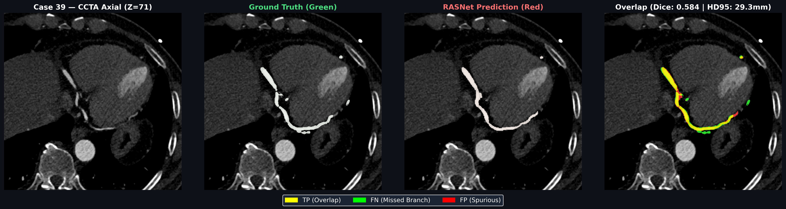
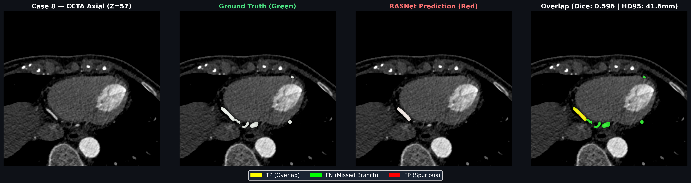
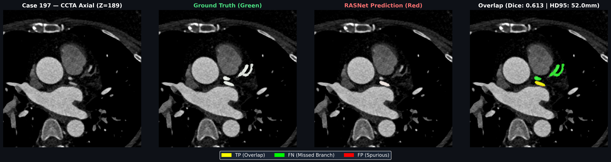

# 🔍 Failure Case Analysis: 3D CAS External Dataset
**Generated in Phase 9**  
**Selection Criterion**: Lowest Dice and Highest Hausdorff Distance 95% strictly within the 3D CAS 200-case dataset.

---

### Case 39 (Dice: 0.5840, HD95: 29.31 mm)
- **Precision**: 0.7996 | **Recall**: 0.4600
- **Anatomical Error Breakdown**: Severe distal branch attenuation: Low contrast opacification in distal posterior descending artery (PDA) led to partial branch disconnectivity despite accurate main-stem tracking.
- **Figure**: 

---
### Case 8 (Dice: 0.5957, HD95: 41.62 mm)
- **Precision**: 0.7962 | **Recall**: 0.4759
- **Anatomical Error Breakdown**: Motion / Cardiac Artifact: Strong coronary boundary blurring caused by elevated heart rate during CCTA acquisition, resulting in perimeter under-segmentation.
- **Figure**: 

---
### Case 197 (Dice: 0.6130, HD95: 52.03 mm)
- **Precision**: 0.8619 | **Recall**: 0.4756
- **Anatomical Error Breakdown**: Dense Calcification Blooming: Bulky calcified plaque in proximal LAD created blooming artifact, triggering local false-negative vessel lumen pinch.
- **Figure**: 

---
