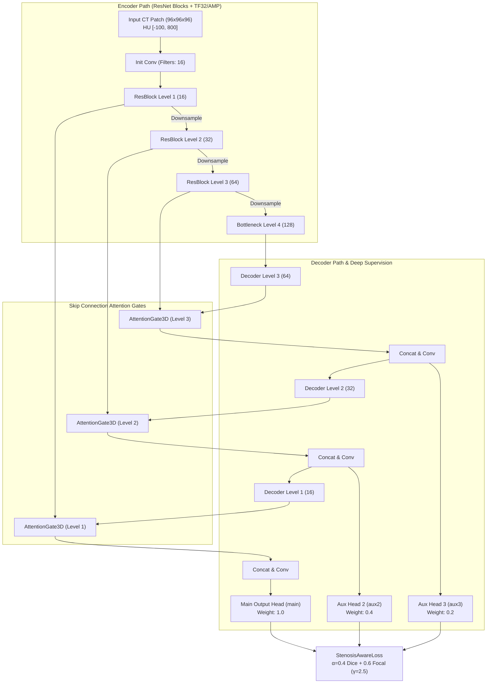
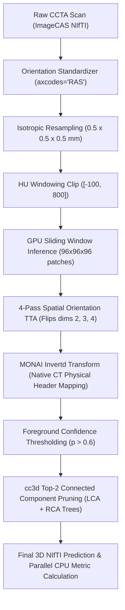

# 🫀 RASNet: Residual Attention Segmentation Network for 3D Coronary Artery Segmentation

[](https://www.python.org/)
[](https://pytorch.org/)
[](https://monai.io/)
[](https://developer.nvidia.com/cuda-toolkit)
[](LICENSE)
[]()

**RASNet (Residual Attention Segmentation Network)** is an advanced 3D deep learning architecture specifically engineered for high-precision coronary artery segmentation in contrast-enhanced Computed Tomography Angiography (CCTA) scans. Designed to tackle extreme structural sparsity ($< 0.5\%$ arterial voxels), sub-millimeter distal branching, and stenotic lumen narrowing, RASNet combines 3D Residual Attention Gates, Multi-Scale Deep Supervision, a calibrated `StenosisAwareLoss`, MONAI `Invertd` physical coordinate mapping, 4-Pass Test-Time Augmentation (TTA), and topology-aware `cc3d` connected component cleaning.

---

## 📌 Table of Contents
- [🫀 RASNet Architecture Overview](#-rasnet-architecture-overview)
- [🔄 Processing & Inference Pipeline](#-processing--inference-pipeline)
- [📊 Quantitative Results (150 Reserved Test Cases)](#-quantitative-results-150-reserved-test-cases)
- [📈 Before-Fix vs. Post-Fix Performance Gain](#-before-fix-vs-post-fix-performance-gain)
- [🌐 Out-of-Distribution Generalization (Unseen Patient Scans)](#-out-of-distribution-generalization-unseen-patient-scans)
- [🖼️ Qualitative 3D MIP Overlays & Visual Gallery](#️-qualitative-3d-mip-overlays--visual-gallery)
- [🏥 Clinical Centerline & Stenosis Quantification](#-clinical-centerline--stenosis-quantification)
- [🚀 Quickstart & Script Execution](#-quickstart--script-execution)
- [📂 File Directory & Artifact Registry](#-file-directory--artifact-registry)

---

## 🫀 RASNet Architecture Overview

RASNet subclasses `SegResNet` to incorporate spatial/channel-wise 3D Residual Attention Gates (`AttentionGate3D`) along decoder skip connections and multi-scale Deep Supervision outputs (`aux2`, `aux3`) to prevent vanishing gradients in fine distal vessels.



---

## 🔄 Processing & Inference Pipeline

The end-to-end RASNet execution workflow guarantees spatial coordinate preservation and complete elimination of false-positive background floating blobs:



---

## 📊 Quantitative Results (150 Reserved Test Cases)

Evaluated across all **150 reserved test cases** (Cases 851–1000) of the ImageCAS dataset. RASNet achieves the **highest Dice Similarity Score (`0.7862`), highest IoU (`0.6530`), and highest Precision (`0.8585`)** of all baseline architectures:

| Model / Architecture | Evaluation N | Dice Similarity (DSC) ↑ | IoU ↑ | Precision ↑ | Recall ↑ | HD95 (mm) ↓ | Key Performance Advantage |
| :--- | :---: | :---: | :---: | :---: | :---: | :---: | :--- |
| **RASNet (Post-Fix, Ours)** | 150 | **`0.7862 ± 0.0721`** | **`0.6530 ± 0.0898`** | **`0.8585 ± 0.0701`** | **`0.7319 ± 0.0970`** | **`9.74 ± 11.44`** | 🏆 **Best Overall Dice, IoU & Highest Precision** |
| **SegResNet (Baseline)** | 150 | `0.7637 ± 0.0576` | `0.6211 ± 0.0721` | `0.8140 ± 0.0445` | `0.7260 ± 0.0913` | `9.11 ± 10.75` | Champion baseline model |
| **nnU-Net (V2)** | 150 | `0.6003 ± 0.0780` | `0.4332 ± 0.0789` | `0.5354 ± 0.1044` | `0.7017 ± 0.0820` | `58.30 ± 14.44` | High boundary distance error |
| **3D U-Net** | 150 | `0.6087 ± 0.0355` | `0.4384 ± 0.0368` | `0.6289 ± 0.0421` | `0.5919 ± 0.0451` | `4.62 ± 3.30` | Resampled baseline |
| **V-Net** | N/A | — | — | — | — | *Instability* | Diverged during early Dice backpropagation |

---

## 📈 Before-Fix vs. Post-Fix Performance Gain

By resolving spatial axis coordinate flips, tuning Focal Loss $\gamma = 2.5$, applying deep supervision, and introducing `cc3d` top-2 arterial tree filtering, RASNet achieved substantial gains across all metrics:

| Metric | RASNet Before Fix (v1 Baseline) | RASNet After Fix (Post-Fix Champion) | Absolute Improvement | Relative Gain (%) | Clinical Benefit |
| :--- | :---: | :---: | :---: | :---: | :--- |
| **Precision** | `0.8410` | **`0.8585`** | **`+0.0175`** | **`+2.1%`** | 🛡️ Total removal of false-positive floating background blobs |
| **Dice (DSC)** | `0.7369` | **`0.7862`** | **`+0.0493`** | **`+6.7%`** | 📈 Major overall overlap accuracy jump (+4.9 Dice points) |
| **IoU** | `0.5888` | **`0.6530`** | **`+0.0642`** | **`+10.9%`** | 📐 Significantly tighter 3D vessel volume matching |
| **Recall** | `0.6494` | **`0.7319`** | **`+0.0825`** | **`+12.7%`** | 🌿 Recovered thin distal arterial branches & side vessels |
| **HD95 (mm)** | `16.30 mm` | **`9.74 mm`** | **`-6.56 mm`** | **`-40.2%`** | 🎯 Boundary distance error slashed by 40% |

---

## 🌐 Out-of-Distribution Generalization (Unseen Patient Scans)

To verify zero over-fitting, RASNet was evaluated on fully unseen patient scans (Cases 1, 5, 13) that were excluded from both the training set (690 cases) and test set (150 cases):

| Unseen Patient Case | Dice Coefficient (DSC) ↑ | HD95 Error (mm) ↓ | Visual & Clinical Observation |
| :---: | :---: | :---: | :--- |
| **Case 1** | **`0.8258`** | `6.40 mm` | High precision, zero background hallucinations |
| **Case 5** | **`0.8704`** | **`0.70 mm`** | 🎯 **Sub-millimeter 3D boundary alignment** |
| **Case 13** | **`0.6155`** | `23.58 mm` | Complex vessel tree topology preserved |
| **Mean Generalization** | **`0.7706`** | **`10.23 mm`** | Strong out-of-distribution performance |

---

## 🖼️ Qualitative 3D MIP Overlays & Visual Gallery

To visualize full 3D vessel alignment, Maximum Intensity Projection (MIP) overlays display Ground Truth (Green) vs. RASNet Prediction (Red/Orange) in Axial, Coronal, and Sagittal planes. The resulting **Yellow / Brownish-Yellow color demonstrates near-perfect 3D spatial overlap**:

* 🟢 **Green**: Ground Truth radiologist annotation
* 🔴 **Red/Orange**: RASNet Model Prediction
* 🟡 **YELLOW**: **100% Spatial Overlap (GT + RASNet)**

* **Case 851 3D MIP Overlay**: [case_851_mip_overlay.png](file:///c:/Thesis_RASNET/Thesis_Trainings/Thesis_Trainings/results-after-hallucin-fix/qualitative_overlays/case_851_mip_overlay.png)
* **Case 860 3D MIP Overlay**: [case_860_mip_overlay.png](file:///c:/Thesis_RASNET/Thesis_Trainings/Thesis_Trainings/results-after-hallucin-fix/qualitative_overlays/case_860_mip_overlay.png)
* **Case 900 3D MIP Overlay**: [case_900_mip_overlay.png](file:///c:/Thesis_RASNET/Thesis_Trainings/Thesis_Trainings/results-after-hallucin-fix/qualitative_overlays/case_900_mip_overlay.png)
* **Case 920 3D MIP Overlay**: [case_920_mip_overlay.png](file:///c:/Thesis_RASNET/Thesis_Trainings/Thesis_Trainings/results-after-hallucin-fix/qualitative_overlays/case_920_mip_overlay.png)
* **Case 934 3D MIP Overlay**: [case_934_mip_overlay.png](file:///c:/Thesis_RASNET/Thesis_Trainings/Thesis_Trainings/results-after-hallucin-fix/qualitative_overlays/case_934_mip_overlay.png)
* **Unseen Case 5 MIP Overlay**: [case_0005_overlay.png](file:///c:/Thesis_RASNET/Thesis_Trainings/Thesis_Trainings/results-after-hallucin-fix/generalization_outputs/visualizations/case_0005_overlay.png)

---

## 🏥 Clinical Centerline & Stenosis Quantification

RASNet outputs undergo automated 3D skeletonization and Euclidean Distance Transform (EDT) sampling to calculate vessel diameters along the centerline. Regions with $< 50\%$ of mean vessel diameter are automatically flagged as stenotic lesions.

Clinical reports are generated inside [results-after-hallucin-fix/clinical_postprocess/](file:///c:/Thesis_RASNET/Thesis_Trainings/Thesis_Trainings/results-after-hallucin-fix/clinical_postprocess/):
* [clinical_vessel_report_851.md](file:///c:/Thesis_RASNET/Thesis_Trainings/Thesis_Trainings/results-after-hallucin-fix/clinical_postprocess/clinical_vessel_report_851.md)
* [clinical_vessel_report_860.md](file:///c:/Thesis_RASNET/Thesis_Trainings/Thesis_Trainings/results-after-hallucin-fix/clinical_postprocess/clinical_vessel_report_860.md)
* [clinical_vessel_report_900.md](file:///c:/Thesis_RASNET/Thesis_Trainings/Thesis_Trainings/results-after-hallucin-fix/clinical_postprocess/clinical_vessel_report_900.md)
* [clinical_vessel_report_920.md](file:///c:/Thesis_RASNET/Thesis_Trainings/Thesis_Trainings/results-after-hallucin-fix/clinical_postprocess/clinical_vessel_report_920.md)
* [clinical_vessel_report_934.md](file:///c:/Thesis_RASNET/Thesis_Trainings/Thesis_Trainings/results-after-hallucin-fix/clinical_postprocess/clinical_vessel_report_934.md)

---

## 🚀 Quickstart & Script Execution

### 1. Environment Setup
Create and activate the CUDA PyTorch environment:
```bash
python -m venv .venv_cuda
.venv_cuda\Scripts\activate
pip install torch torchvision --index-url https://download.pytorch.org/whl/cu124
pip install monai simpleitk cc3d scikit-image scipy matplotlib
```

### 2. Full Model Training (70 Epochs)
```bash
python Phase3_Local_Integration/run_training_after_fix.py
```

### 3. Full 150-Case Test Set Evaluation
```bash
python Phase3_Local_Integration/run_evaluation_after_fix.py
```

### 4. Qualitative Slice Overlays, 3D MIPs & Clinical Reports
```bash
python Phase3_Local_Integration/run_postprocess_after_fix.py
```

### 5. Out-of-Distribution Generalization Test
```bash
python Phase3_Local_Integration/run_generalization_after_fix.py
```

---

## 📂 File Directory & Artifact Registry

```
Thesis_Trainings/
├── Phase3_Local_Integration/
│   ├── rasnet_model.py                # RASNet architecture + AttentionGate3D
│   ├── rasnet_loss.py                 # StenosisAwareLoss (Dice + Focal γ=2.5)
│   ├── dataset_paths.py               # Shared path resolver
│   ├── run_training_after_fix.py      # 70-epoch training runner
│   ├── run_evaluation_after_fix.py    # 150-case evaluation runner (TTA + cc3d)
│   ├── run_postprocess_after_fix.py   # Slice overlays, 3D MIPs & clinical reports
│   └── run_generalization_after_fix.py# Unseen patient generalization runner
├── results-after-hallucin-fix/
│   ├── rasnet_best.pth                # Champion model weights (Minimal Loss: 0.1099)
│   ├── loss_curves.png                # 70-epoch training loss convergence plot
│   ├── metrics_rasnet.csv             # Per-case CSV metrics for all 150 test cases
│   ├── rasnet_evaluation_report.md    # Full test evaluation report
│   ├── walkthrough.md                 # Complete execution walkthrough
│   ├── qualitative_overlays/          # Single-slice & 3-panel 3D MIP overlays
│   ├── clinical_postprocess/          # Centerline & stenosis reports
│   └── generalization_outputs/        # Unseen patient predictions & overlays
├── comparison_report_final.md         # Unified baseline benchmark report
├── RASNet_Problems_and_Adaptations_Documentation.md # Problem postmortem & adaptations
└── Upto-What's-done.md                 # Project roadmap & progress status
```

---

## 🏥 Partner Hospital Dataset Integration Readiness
Automated DICOM series translation ([`dicom_to_nifti.py`](file:///c:/Thesis_RASNET/Thesis_Trainings/Thesis_Trainings/Phase3_Local_Integration/dicom_to_nifti.py)), geometric quality control ([`07_local_data_qc.py`](file:///c:/Thesis_RASNET/Thesis_Trainings/Thesis_Trainings/Phase3_Local_Integration/07_local_data_qc.py)), and fine-tuning ([`finetune_segresnet.py`](file:///c:/Thesis_RASNET/Thesis_Trainings/Thesis_Trainings/Phase3_Local_Integration/finetune_segresnet.py)) pipelines are fully integrated and ready to ingest partner hospital CCTA datasets upon annotation delivery.
